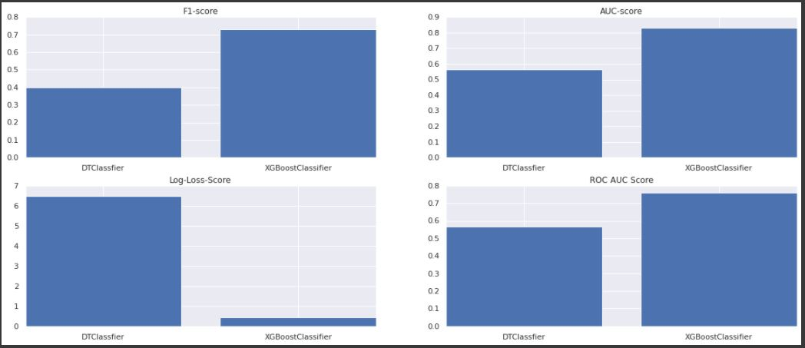
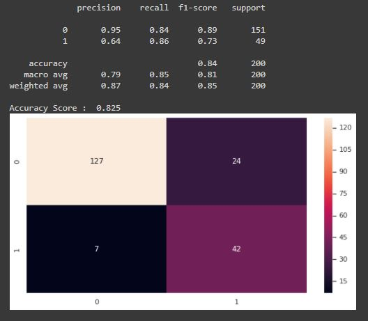

# Auto-Insurance-Claim-Fraud-Detection

 

## Business Objectives :

The challenge behind fraud detection in machine learning is that frauds are far less common as compared to legit insurance claims. Frauds are unethical and are losses to the company. Insurance fraud is a deliberate deception perpetrated against or by an insurance company or agent for the purpose of financial gain.

By building a model that can classify auto insurance fraud, we can cut losses for the insurance company. 

The goal of this project is to build a model that can detect auto insurance fraud. 

## Data Collection :

The dataset has been obtained from kaggle. 

Link : https://www.kaggle.com/roshansharma/insurance-claim

The data set consist of 1000 auto incidents and auto insurance claims from Ohio, Illinois and Indiana from 01 January 2015 to 01 March 2015.The data set has a total of 39 features.

## Modelling :

The following modelling approach was used in the project:

1. Loading and cleaning the raw data
2. Exploratory Data Analysis
3. Applying various classification models
4. Hyper-parameter Optimization

The detailed analysis and model creation can be found in the .ipynb file. 

## Result :

The performance comparison of the Classifier is as follows:

The performance of Xgboost Classifier is as follows:

## Conclusion :

This project has built a model that can detect auto insurance fraud. In doing so, the model can reduces loses for insurance companies. The challenge behind fraud detection in machine learning is that frauds are far less common as compared to legit insurance claims.

Many different classifiers were used in this project. 3 different ways of handling imbalance classes were tested out with these classifiers: model with class weighting and hyperparameter tuning, oversampling with SMOTE, oversampling with ADASYN.

Out of various classification algorithms, Xgboost tend to gives most balanced performance with:
1.   Accuracy Score = 54%
2.   Precision = 64%
3.   Recall = 84%
4.   F1 Score = 73%
5.   AUC = 0.83
